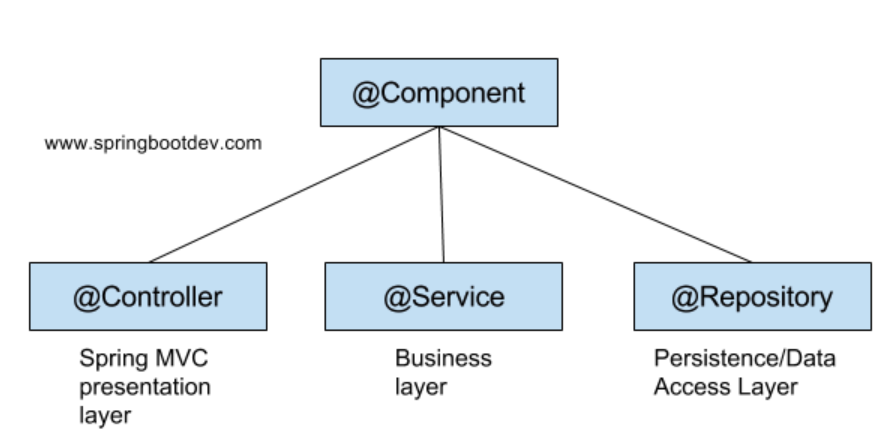

# Annotation
Spring framework 에 해당 클래스/메소드가 어떤 역할을 하는지 알림

### @Component
- 개발자가 직접 작성한 class 자체를 Spring Bean 으로 등록
  ```java
  @Component
  public class MyComponent {
  // 클래스 내용
  }
  ```
- 하위로 @Controller, @Service, @Repository 어노테이션이 있다
 

### @Configuration
- 스프링에게 해당 클래스가 Bean 구성 Class 임을 알림
  - 즉, Bean 등록용 class로 사용함
  - 일반 메소드도 만들수있으며 주로 Bean 을 보조하는 역할

### @Bean
- 스프링 컨테이너에 의해 관리되는 재사용 가능한 소프트웨어 컴포넌트
- 스프링 간 객체가 의존관계를 관리하도록 하는 것에 가장 큰 목적
- 외부 라이브러리 등 반환되는 객체를 Bean 으로 등록
- 쉽게말하면 new ~ 로  생성하지않아도 된다
- xml에 bean 추가하거나 @Bean 어노테이션으로 추가

```java
@Configuration //여기는 @Bean 등록 전용 class!
public class TestConfig {

    @Bean
    public MyBean myBean() {
      return new MyBean();
    }
    
    @Bean(name="myMethod")
    public MyBean myBean() {
      return new MyBean();
    }
    
    // @Bean 어노테이션이 없는 메소드
    public SomeConfiguration someConfiguration() {
      // 구성 정보 반환
      return new SomeConfiguration();
    }
}

```

### @Controller
- 예시 소스코드 : MainController
- 일반적인 Spring MVC 컨트롤러
- 주로 view 를 반환하기 위하여 사용됨

#### View 반환
1. Client 에서 URI 형식으로 요청
2. DispatcherServlet 에서 요청을 처리할 대상 조회
3. HandlerAdapter 를 통해 요청을 Controller 로 위임
4. Controller 에서 서비스로직 실행 후 **view** 반환
5. DispatcherServlet 은 ViewResolver 를 통해 View 를 찾아 반환

#### View + Data 반환
1. Client 에서 URI 형식으로 요청
2. DispatcherServlet 에서 요청을 처리할 대상 조회
3. HandlerAdapter 를 통해 요청을 Controller 로 위임
4. Controller 에서 서비스로직 실행 후 **view** 와 **Data** 를 함께 반환

### @RestController
- 예시 소스코드 : MainRestController
- RestFul 웹서비스의 컨트롤러
- @Controller + @RequestBody 의 기능을 한다
- ResponseEntity 형식으로 return
  - HttpStatus, data 를 Json 객체로 반환

1. Client 에서 URI 형식으로 요청
2. DispatcherServlet 이 요청을 처리
3. HandlerAdapter 를 통해 요청을 Controller로 위임
4. Controller 에서 서비스로직 실행 후 **객체** 반환
5. 반환 시 Json 으로 Serialize 되어 Client 로 반환

### @RequestMapping
- 예시 소스코드 : MainController, MainRestController
- Client 에서 요청한 RI와 Controller 의 Method 매핑을 설정하는 어노테이션
- @RequestMapping GET == GetMapping
- 단독으로 사용되기보단 prefix 개념으로 class 전체 어노테이션으로 사용되는 경우가 많음

- 아래 소스코드는 동일한 작동을 함
  ```java
  @RequestMapping(value = "/main", method = RequestMethod.GET)
  public String index() {
      return "";
  }    
  
  @GetMapping(value = "/main")
  public String index2() {
      return "";
  }
  ```
### @RequestBody
- Client 에서 요청 시 복수의 parameter 를 전달받을 때 사용
- json 기반의 Http Body 를 자바객체로 변환
  - Client 에서 보낸 json body를 객체형태로 매핑
- 예시 소스코드 : MainController
  - Client
  ```javascript
  var param = {
      title : "1111",
      content : "hello",
      userName : "admin"
  }
  ```

  - Controller
  ```java
  @PostMapping(value = "/index-request")
    public String indexRequest(@RequestBody PostDto postDto) {
        return "/user/index";
    }
  ```
### @ResponseBody
- Client 로 data 반환 시 사용한다
- data 를 json 으로 바꿔 반환한다
- 예시 소스코드 : MainController
  - ResponseEntity 반환 시 Client 에 들어오는 데이터

  ```javascript
  var response = {
        "data": {
            "loginId": "admin"
        },
        "status": 200
  }
  ```

### @Service
- 비즈니스 로직을 구현하는 객체에 사용

# Utils

#### 1. ApiResponseEntity
- ResponseEntity 커스텀 객체
- Controller 에서 데이터 반환 시 Pagination, list, map, String, HttpStatus 등 다양한 데이터를 반환하기 위하여 사용되는 공통 객체
